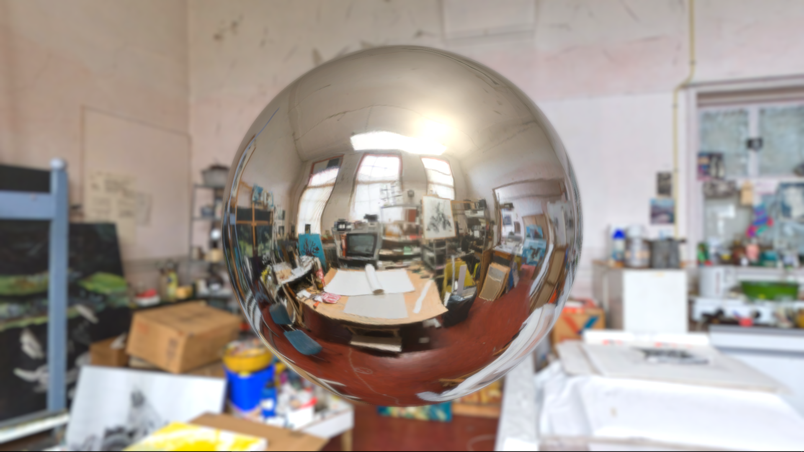

# Unity-Reflection-Probe-Study
Many tutorials about Unity's reflection probe out there such as [this one on YouTube](https://t.co/H3hrkWIJPI). I just wanted to make sure if I could make something interesting to see by applying this kind of reflection. Reflective materials could make your games/artworks visually better certainly. Those materials do not necessarily have to be metallic. Rubber-like materials come to mind. 

Video on YouTube(https://youtu.be/60W22o5bys0)

##Photo
[Theo Kemp's atelier](https://www.flickr.com/photos/aldo/2503297232/in/photolist-4Pd447-5upSFX-69zv2p-WHhb2u-69DFvf-H7k9AZ-69DFxf-69zuWv-69DFGf-WLUxMH-PJEkF1-PJeMtx-NF4BSB-PkJWBw-PUrHcr-PkJVaJ-NF4CXT-PMngHg-NF4KRc-PJEozs-PRcz5b-NF4HeZ-PXAhGt-PJEkq1-NFfhzN-PRcwxN-PJEoRQ-PJEp43-PFBxq7-PJEpkA-NDPZ1J-PJEkRG-PoNdUh-PJEoBS-PkJZhw-NJ9WSn-PRcyd1-PkJZHb-NDPYwh-PUibFd-PUibBW-PoNfgA-PRcBcs-PoNdCf-PMngRT-PJEoKN-NJ9WJr-NFfhDA-PJEosy-NF4D9e) by [Aldo Hoeben](https://www.flickr.com/photos/aldo/) under [CC BY-NC 2.0.](https://creativecommons.org/licenses/by-nc/2.0/).